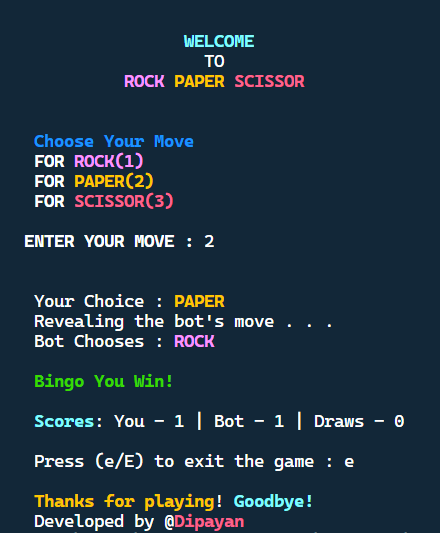

# Rock Paper Scissors Game

## Description
This is a simple **Rock Paper Scissors** game implemented in **C**. The game allows the user to play against the computer, following the traditional rules of Rock Paper Scissors.

## Features
- User vs Computer gameplay
- Randomized computer choices
- Interactive command-line interface
- Keeps track of wins, losses, and ties

## How to Play
1. The user selects either **Rock (1)**, **Paper (2)**, or **Scissors (3)**.
2. The computer randomly selects one of the three options.
3. The winner is decided based on the following rules:
   - Rock beats Scissors
   - Scissors beats Paper
   - Paper beats Rock
4. The result (Win/Loss/Tie) is displayed.

## Installation & Compilation
### Prerequisites
- A C compiler (GCC recommended)
- Terminal or Command Prompt

### Steps to Compile and Run
1. Clone the repository (if using Git):
   ```sh
   git clone https://github.com/DipayanSadhukhan/_rock-paper-scissors.git
   cd _rock-paper-scissors
   ```
2. Compile the code:
   ```sh
   gcc _rock_paper_scissors.c -o _rock_paper_scissors
   ```
3. Run the game:
   ```sh
   ./_rock_paper_scissors
   ```

## Example Output
```
                WELCOME
                  TO
          ROCK PAPER SCISSOR
 
 
 Choose Your Move 
 FOR ROCK(1) 
 FOR PAPER(2) 
 FOR SCISSOR(3) 
 
ENTER YOUR MOVE : 2

 
 Your Choice : PAPER
 Revealing the bot's move . . .
 Bot Chooses : SCISSOR

 You Lose!

 Scores: You - 0 | Bot - 1 | Draws - 0

 Press (e/E) to exit the game : e

 Thanks for playing! Goodbye!
 Developed by @Dipayan
```
## ScreenShot Of Output



## Future Enhancements
- Implement a **scoreboard** to track multiple rounds.
- Add a **multiplayer mode**.
- Create a **GUI version** using a graphics library.

## License
This project is open-source and available under the **MIT License**.

## Contributing
Feel free to contribute by creating pull requests or reporting issues!

## Authors
GitHub: [Dipayan Sadhukhan](https://github.com/DipayanSadhukhan)

